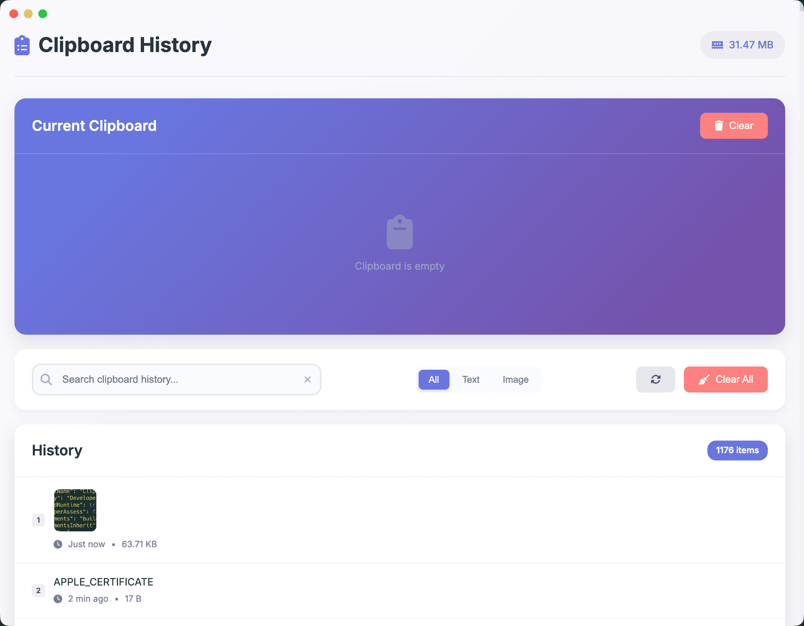

# 剪贴板历史管理器

[English](README.md)

一款美观、安全、注重隐私的剪贴板历史管理工具，基于 Electron 构建。

## 截图



## 下载

从 [Releases 页面](../../releases) 下载最新版本：

- **Apple Silicon (M1/M2/M3/M4)**: `Clipboard-History-Manager-*-arm64.dmg`
- **Intel Mac**: `Clipboard-History-Manager-*-x64.dmg`

## 功能特性

- **完全隐私**: 完全离线运行，不向任何服务器发送数据
- **文本和图片支持**: 同时处理文本和图片剪贴板内容
- **智能搜索**: 即时过滤搜索剪贴板历史记录
- **全局快捷键**: `Cmd+Shift+V` 快速切换剪贴板历史窗口
- **自动粘贴**: 选择历史条目后自动粘贴到当前活动的输入框
- **窗口置顶**: 窗口可见时通过快捷键切换置顶模式
- **窗口拖拽**: 自由拖拽窗口位置，位置在会话间持久保存
- **编号显示**: 历史条目以编号标签显示，方便快速定位
- **内存管理**: 实时显示内存使用情况，自动清理（500MB 上限）
- **快捷键**: `Cmd+F` 搜索，`Cmd+R` 刷新，`Escape` 关闭

## 快速开始

1. **安装依赖**:
   ```bash
   npm install
   ```

2. **启动应用**:
   ```bash
   npm start
   ```

3. **构建生产版本**:
   ```bash
   npm run build
   ```

## 使用说明

### 基本操作
- **全局快捷键**: 按 `Cmd+Shift+V` 切换剪贴板历史窗口
- **选择并粘贴**: 点击任意历史条目即可复制并自动粘贴到活动输入框
- **浏览历史**: 滚动查看所有带编号的剪贴板条目
- **搜索**: 使用搜索框按文本内容过滤
- **删除条目**: 点击单个条目上的垃圾桶图标
- **清除全部**: 使用"清除全部"移除所有历史记录

### 快捷键
- `Cmd + Shift + V`: 切换剪贴板历史窗口
- `Cmd + F`: 聚焦搜索框
- `Cmd + R`: 刷新剪贴板历史
- `Escape`: 清除搜索或关闭弹窗

### 隐私特性
- **无持久存储**: 所有数据仅保存在内存中
- **无网络访问**: 完全离线运行
- **无内容日志**: 敏感内容绝不记录到日志
- **纯内存存储**: 应用关闭时历史记录自动清除

## 架构

- **前端**: 纯 HTML/CSS/JavaScript，现代化设计
- **后端**: Electron 主进程，安全的 IPC 通信
- **安全**: 启用上下文隔离，渲染进程无 Node.js 访问权限
- **监控**: 1 秒轮询剪贴板，智能去重检测

## 开发

### 文件结构
```
├── main.js              # Electron 主进程
├── package.json         # 项目配置
└── renderer/
    ├── index.html       # 主界面
    ├── styles.css       # 样式
    ├── app.js           # 前端逻辑
    └── preload.js       # 安全 IPC 桥接
```

### 日志
日志文件位置：
- **macOS**: `~/Library/Logs/clipboard-history-manager/main.log`
- **Windows**: `%USERPROFILE%\AppData\Roaming\clipboard-history-manager\logs\main.log`
- **Linux**: `~/.config/clipboard-history-manager/logs/main.log`

## 构建

### 创建可分发安装包：
```bash
npm run build    # 为当前平台创建安装包
npm run pack     # 创建未打包目录
```

## 安全说明

- 所有剪贴板内容仅保存在内存中
- 不会将数据持久化到磁盘
- 不建立任何网络连接
- 日志中绝不包含内容（仅记录大小和类型等元数据）
- 主进程和渲染进程之间采用安全的 IPC 通信

## 许可证

MIT 许可证 - 可自由使用和修改。
